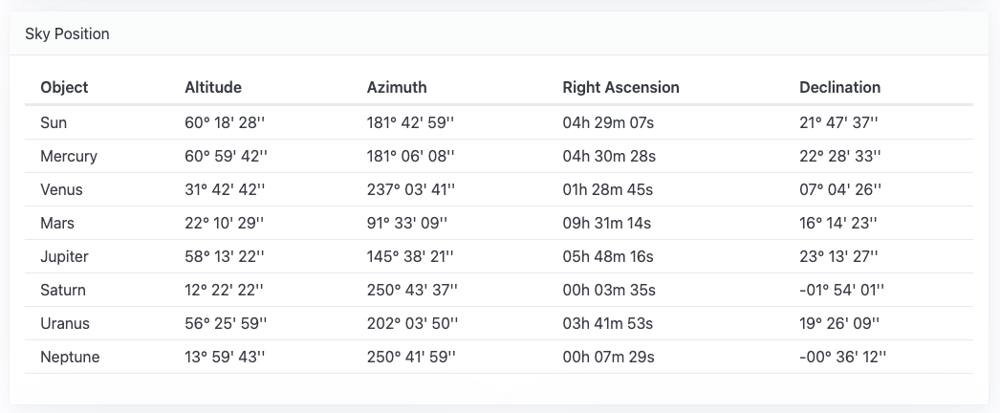

AstronomyJS
===========

[](https://travis-ci.org/alexandreribeiro/astronomy.js)
[](https://coveralls.io/github/alexandreribeiro/astronomy.js?branch=master)

Astronomical calculations in JavaScript.

---
## 🚀 See It in Action!
These tiles were generated using the astronomy-svg library.

👉 [**Check out the live demo here**](https://alexandreribeiro.github.io/astronomy-js/demo/)

[](https://alexandreribeiro.github.io/astronomy-js/demo/)

---

## 🪐 Supported Calculations

- Right Ascension / Declination for celestial body
- Hour Angle / Declination for celestial body
- Altitude / Azimuth for celestial body
- Ephemeris for the Sun (astronomical twilight, nautical twilight, civil twilight)
- Ephemeris for celestial body (rise, set)
- 🔭 Includes Pluto!

---

## Quickstart

### 🌐 Using the Browser-Ready Minified Script

```javascript
<script type="text/javascript" src="astronomy-js.min.js"></script>
// latitude, longitude
let astronomyJS = AstronomyJS.initialize(56.2, 18.1)
astronomyJS.getAltAzCoordinatesForObject("Sun");
```

### 🌟 Installation (npm)

```bash
npm install astronomyjs
```

#### Using the JavaScript ES Module
```javascript
import { AstronomyJS } from "astronomyjs";
// latitude, longitude
let astronomyJS = AstronomyJS.initialize(56.2, 18.1)
astronomyJS.getAltAzCoordinatesForObject("Sun");
```

## 📄 License

This project is licensed under the MIT License — feel free to use, modify, and share it.  
Please make sure to retain the original license and attribution when reusing or modifying the code.  
See the [LICENSE](./LICENSE) file for full details.

## 🌌 About

This library provides astronomical calculations for leisure purposes only.
Some important basic aspects are not implemented, such as:
- Atmospheric refraction
- Orbit perturbations

 


## 📚 References
US Naval Observatory, Explanatory Supplement to the Astronomical Almanac, 1992
