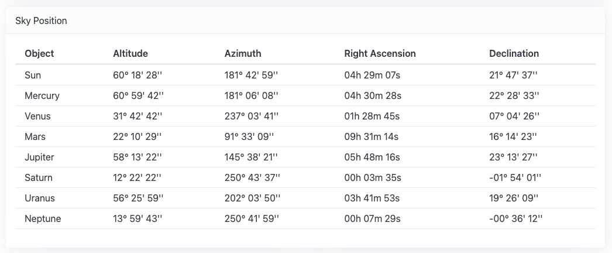

AstronomyJS
===========

[](https://travis-ci.org/alexandreribeiro/astronomy.js)
[](https://coveralls.io/github/alexandreribeiro/astronomy.js?branch=master)

Astronomical calculations in JavaScript.

---
## 🚀 See It in Action!
These tiles were generated using the astronomy-svg library.

👉 [**Check out the live demo here**](https://alexandreribeiro.github.io/astronomy-js/demo/)

[](https://alexandreribeiro.github.io/astronomy-js/demo/)

---

## 📖 API Reference

### `AstronomyJS`

The main class to interact with the library.

#### Static Methods

- `initialize(latitude, longitude)`
  - Initializes a new `AstronomyJS` instance with the given coordinates on Earth.
  - **Parameters:**
    - `latitude` (number): Latitude in degrees.
    - `longitude` (number): Longitude in degrees.
  - **Returns:** `AstronomyJS` instance.
  - **Example:**
    ```javascript
    const astronomy = AstronomyJS.initialize(52.52, 13.405);
    // Returns: AstronomyJS { ... }
    ```

#### Instance Methods

- `setDate(date)`
  - Sets the simulation date.
  - **Parameters:** 
    - `date` (Date object): The new simulation date.
  - **Example:**
    ```javascript
    astronomy.setDate(new Date("2024-03-20T12:00:00Z"));
    ```
- `getDate()`
  - Returns the current simulation date.
  - **Returns:** The current simulation `Date` object.
  - **Example:**
    ```javascript
    const date = astronomy.getDate();
    // Returns: 2024-03-20T12:00:00.000Z
    ```
- `setJulianDate(julianDate)`
  - Sets the simulation date using Julian Date.
  - **Parameters:** 
    - `julianDate` (number): The new Julian Date.
  - **Example:**
    ```javascript
    astronomy.setJulianDate(2460389.5);
    ```
- `getJulianDate()`
  - Returns the current Julian Date.
  - **Returns:** The current Julian Date (number).
  - **Example:**
    ```javascript
    const julianDate = astronomy.getJulianDate();
    // Returns: 2460389.5
    ```
- `setLocation(objectName, latitude, longitude, elevation)`
  - Sets the observer's location.
  - **Parameters:**
    - `objectName` (string): Name of the solar system body (e.g., "Earth").
    - `latitude` (number): Latitude in degrees.
    - `longitude` (number): Longitude in degrees.
    - `elevation` (number): Elevation from surface in meters.
  - **Example:**
    ```javascript
    astronomy.setLocation("Earth", 48.8566, 2.3522, 35);
    ```
- `getAltitudeAzimuthCoordinatesForObject(objectName, [referenceDate])`
  - Calculates Altitude and Azimuth for a given object.
  - **Parameters:**
    - `objectName` (string): Name of the object (e.g., "Sun", "Moon", "Mars").
    - `referenceDate` (Date, optional): Overrides the instance date.
  - **Returns:** Object with `azimuth`, `altitude`, and `distance`.
  - **Example:**
    ```javascript
    const coordinates = astronomy.getAltitudeAzimuthCoordinatesForObject("Sun");
    /*
    Returns:
    {
      "azimuth": 185.23,
      "altitude": 42.15,
      "distance": 0.9958,
      "observerLocation": { ... }
    }
    */
    ```
- `getRightAscensionDeclinationCoordinatesForObject(objectName, [referenceDate])`
  - Calculates Right Ascension and Declination.
  - **Parameters:**
    - `objectName` (string): Name of the object (e.g., "Sun").
    - `referenceDate` (Date, optional): Overrides the instance date.
  - **Returns:** Object with `rightAscension`, `declination`, and `distance`.
  - **Example:**
    ```javascript
    const coordinates = astronomy.getRightAscensionDeclinationCoordinatesForObject("Sun");
    /*
    Returns:
    {
      "rightAscension": 358.12,
      "declination": -1.25,
      "distance": 0.9958,
      "observerLocation": { ... }
    }
    */
    ```
- `getHourAngleDeclinationCoordinatesForObject(objectName, [referenceDate])`
  - Calculates Hour Angle and Declination.
  - **Parameters:**
    - `objectName` (string): Name of the object (e.g., "Sun").
    - `referenceDate` (Date, optional): Overrides the instance date.
  - **Returns:** Object with `hourAngle`, `declination`, and `distance`.
  - **Example:**
    ```javascript
    const coordinates = astronomy.getHourAngleDeclinationCoordinatesForObject("Sun");
    /*
    Returns:
    {
      "hourAngle": 15.45,
      "declination": -1.25,
      "distance": 0.9958
    }
    */
    ```
- `getIlluminatedFractionForObject(objectName, [referenceDate])`
  - Calculates the illuminated fraction for light coming from the Sun for a given object.
  - **Parameters:**
    - `objectName` (string): Name of the object (e.g., "Moon").
    - `referenceDate` (Date, optional): Overrides the instance date.
  - **Returns:** Number between 0 and 1 representing the illuminated fraction.
  - **Example:**
    ```javascript
    const illuminatedFraction = astronomy.getIlluminatedFractionForObject("Moon");
    /*
    Returns: 0.253
    */
    ```
- `getEphemerisDateForObject(objectName, referenceDate, ephemerisTypeName)`
  - Finds the date of an ephemeris event (e.g., "Rise", "Set").
  - **Parameters:**
    - `objectName` (string): e.g., "Sun".
    - `referenceDate` (Date): The date to search around.
    - `ephemerisTypeName` (string): e.g., "SUNRISE", "SUNSET", "CIVIL_TWILIGHT_START".
  - **Returns:** `Date` or `null`.
  - **Example:**
    ```javascript
    const sunrise = astronomy.getEphemerisDateForObject("Sun", new Date(), "SUNRISE");
    // Returns: 2024-03-20T06:15:22.000Z
    ```
- `getLocalMeanSiderealTime()`
  - Returns the Local Mean Sidereal Time in degrees.
  - **Returns:** Local Mean Sidereal Time in degrees (number).
  - **Example:**
    ```javascript
    const localMeanSiderealTime = astronomy.getLocalMeanSiderealTime();
    // Returns: 185.45
    ```
- `getLatitudeLongitudeCoordinates()`
  - Returns the current observer's latitude and longitude.
  - **Returns:** Object with the current observer's `latitude` and `longitude`.
  - **Example:**
    ```javascript
    const coordinates = astronomy.getLatitudeLongitudeCoordinates();
    /*
    Returns:
    {
      "latitude": 52.52,
      "longitude": 13.405
    }
    */
    ```
- `getObserverLocation()`
  - Returns the full observer location details.
  - **Returns:** Full `ObserverLocation` object or `null`.
  - **Example:**
    ```javascript
    const location = astronomy.getObserverLocation();
    // Returns: ObserverLocation { longitude: 13.405, latitude: 52.52, ... }
    ```
- `getSkyObjectByName(objectName)`
  - Retrieves a sky object's data by its name.
  - **Parameters:**
    - `objectName` (string): Name of the object (e.g., "Jupiter").
  - **Returns:** `SolarSystemObject` data or `null`.
  - **Example:**
    ```javascript
    const jupiter = astronomy.getSkyObjectByName("Jupiter");
    // Returns: Jupiter { name: "Jupiter", ... }
    ```

### 🪐 Supported Objects and Ephemeris Types

The library includes data for major solar system bodies and various ephemeris events.

#### Common Objects
- `Sun`, `Moon`
- Planets: `Mercury`, `Venus`, `Earth`, `Mars`, `Jupiter`, `Saturn`, `Uranus`, `Neptune`
- Dwarf Planets: `Pluto`

#### Ephemeris Types
Use these names with `getEphemerisDateForObject`:
- `RISE`, `SET`, `SUNRISE`, `SUNSET`, `MOONRISE`, `MOONSET`
- `CIVIL_TWILIGHT_START`, `CIVIL_TWILIGHT_END`
- `NAUTICAL_TWILIGHT_START`, `NAUTICAL_TWILIGHT_END`
- `ASTRONOMICAL_TWILIGHT_START`, `ASTRONOMICAL_TWILIGHT_END`
- `GOLDEN_HOUR_START`, `GOLDEN_HOUR_END`

---

## 🪐 Supported Calculations

- Right Ascension and Declination for celestial body
- Hour Angle and Declination for celestial body
- Altitude and Azimuth for celestial body
- Ephemeris for the Sun (astronomical twilight, nautical twilight, civil twilight)
- Ephemeris for celestial body (rise, set)
- 🔭 Includes Pluto!
---

## Quickstart

### 🌐 Using the Browser-Ready Minified Script

```javascript
<script type="text/javascript" src="astronomy-js.min.js"></script>
// latitude, longitude
let astronomyJS = AstronomyJS.initialize(56.2, 18.1)
astronomyJS.getAltitudeAzimuthCoordinatesForObject("Sun");
```

### 🌟 Installation (npm)

```bash
npm install astronomy-js
```

#### Using the JavaScript ES Module

```javascript
import { AstronomyJS } from "astronomy-js";
// latitude, longitude
let astronomyJS = AstronomyJS.initialize(56.2, 18.1)
astronomyJS.getAltitudeAzimuthCoordinatesForObject("Sun");
```

## 📄 License

This project is licensed under the MIT License — feel free to use, modify, and share it.  
Please make sure to retain the original license and attribution when reusing or modifying the code.  
See the [LICENSE](./LICENSE) file for full details.

## 🌌 About

This library provides astronomical calculations for leisure purposes only.
Some important basic aspects are not implemented, such as:
- Atmospheric refraction
- Orbit perturbations

 


## 📚 References
US Naval Observatory, Explanatory Supplement to the Astronomical Almanac, 1992
